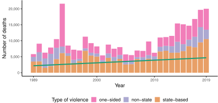
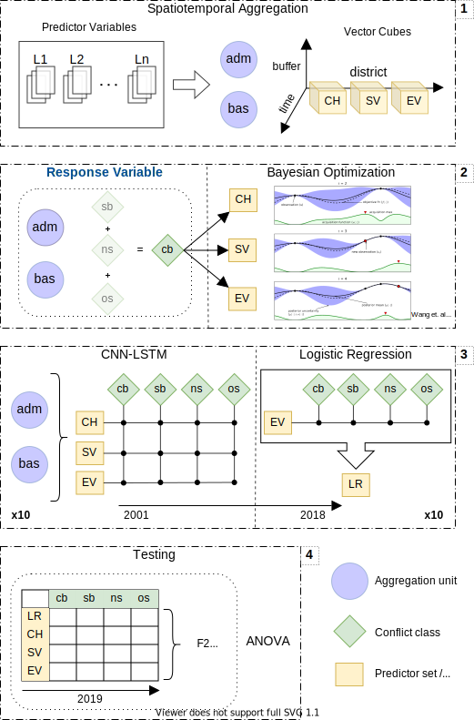
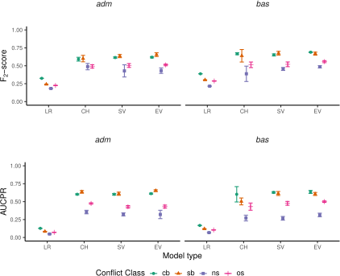
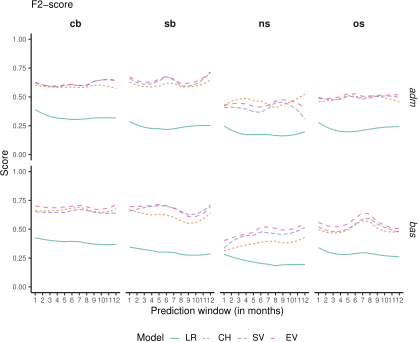
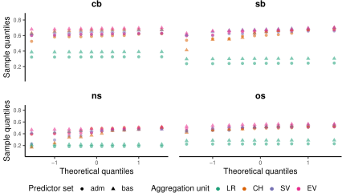
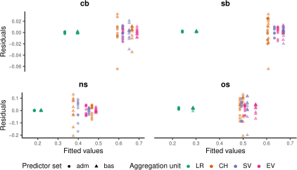
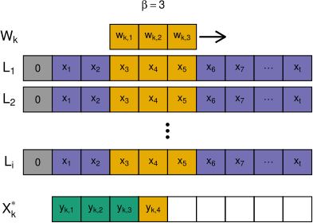
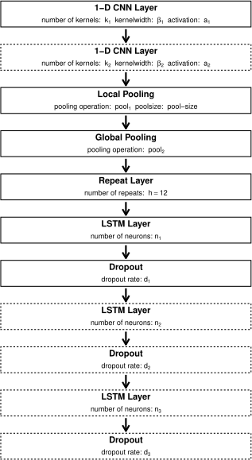
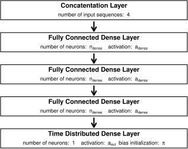

```{r setup, include=FALSE}
options(htmltools.dir.version = FALSE)
knitr::opts_chunk$set(
  warning = FALSE, message = FALSE
)
library(tidyverse)
library(raster, exclude = c("select", "filter"))
library(sf)
library(knitr)
library(tmap)
library(magrittr)
library(ggtext)
library(gridExtra)
library(cubelyr)
library(kableExtra)
library(latex2exp)
library(RColorBrewer)
library(scales)
library(ggpubr)
library(rstatix)
library(welchADF)
library(plotly)
library(widgetframe)
library(xaringanExtra)
use_xaringan_extra("broadcast")
source("../report/thesis-output/thesis-utils.R")
tmap_options(output.dpi = 300)
```

# Content

.pull-left[

Introduction
--
Methodology
--
Main Findings
--
Discussion
--
Conclusion
--
]

.pull-right[

```{r conflict-map, dpi=300, fig.height=5, fig.width=7, fig.cap="Total number of conflict events 2000 to 2019 for administrative districts (left) and sub-basin watersheds (right) in the UCDP database.",eval=F}

bas = st_read("../data/vector/response/response_all_basins_mask.gpkg.gpkg", quiet = T)
adm = st_read("../data/vector/response/response_all_states_mask.gpkg.gpkg", quiet = T)
bas = st_simplify(bas, preserveTopology = T, dTolerance = 0.01)
adm = st_simplify(adm, preserveTopology = T, dTolerance = 0.01)

bas$total = rowSums(st_drop_geometry(bas))
adm$total = rowSums(st_drop_geometry(adm))


tmap_options(output.dpi = 300)
map_adm = tm_shape(adm) +
  tm_polygons("total", 
              title = "Nr. of conflict events\n (2000 - 2019)",
              border.col = "black", 
              lwd = .2, 
              n = 10, 
              style = "cont", 
              palette = "Blues",
              breaks = c(0,500,1000,5000,10000,30000)) +
  tm_legend(show = TRUE) +
  tm_layout("Administrative districts",
            title.size = .8,
            bg.color = "white")
map_bas = tm_shape(bas) +
  tm_polygons("total", 
              title = "Nr. of conflict events\n (2000 - 2019)",
              border.col = "black", 
              lwd = .2, 
              n = 10, 
              style = "cont", 
              palette = "Blues",
              breaks = c(0,500,1000,5000,10000,30000)) +
  tm_legend(show = FALSE) +
  tm_layout("Sub-basin watersheds districts",
            title.size = .8,
            bg.color = "white") +
  tm_scale_bar(position=c("left", "bottom"), width = .5)

tmap_arrange(map_adm, map_bas)

```
]

---

class: inverse, center, middle

# Introduction

---

# Introduction

.pull-left[
- violent conflicts impede social and economical development and put environmental 
resources at risk 

- we observe complex non-linear relationships with natural resources, e.g.
food production (see [Koren, 2018](https://doi.org/10.1093/ajae/aax106) and [Buhaug et al., 2015](https://doi.org/10.1088/1748-9326/10/12/125015))

- research activities on violent conflicts are found between inferential statistics
and prediction models (see [Ward et al, 2010](https://doi.org/10.1177/0022343309356491))

- environmental variables as predictors are barley found despite a public focus
on environmental change and its consequences

- on the African continent violent conflict seems to be on the rise during the
21st millennium
]

<br>
<br>
<br>
.pull-right[

]


---

class: inverse, center, middle

# Research question

---

# Research question

<br>

*Does a modern deep learning framework and the vast availability
of open geodata positively impact the task of spatio-temporal conflict detection?*

<br>

--

- **H1**: Environmental predictors increase the performance of deep learning models for the
conflict prediction task over models based solely on the conflict history and structural
variables.

--

- **H2**: Aggregating predictor and response variables on the basis of sub-basin watersheds
delivers better predictive performance than aggregating on sub-national administrative
districts.


---

class: inverse, center, middle

# Methodology

---

# Methodology

## (1) Spatio-Temporal Aggregation

.pull-left[
- collection of 40 predictors (2001 - 2019) in spatially explicit formats

- spatio-temporal aggregation on two units of analysis (_adm_ and _bas_) and 4 spatial
buffers (0, 50, 100, 200 km)

- temporal split of training, validation, and testing data sets (2001 - 2016, 2017 - 2018, 2019)

- splitting into 3 predictor sets: Conflict History (CH), Structural Variables (SV), and Environmental Variables (EV)

> $X_t^L= x_t^1,x_{t+1}^1...,x_{t-N+1}^1,...\ ..., x_t^L,...,x_{t-N+1}^L$

]

.pull-right[
</img>
]

---

# Methodology

## (2) Response Variable & Bayesian Optimization

.pull-left[

- binary encoding of response variable (3 conflict classes + 1 combined class)

- Bayesian optimization of CNN-LSTM Hyperparameters based on combined conflict class (**cb**) 

- 100 random trials + 100 optimization trials for all combinations of *aggregation units* **per** *predictor sets*

> $x_{t} = arg \;\underset{x}{max} \, u(x|D_{1:t-1})$


]

.pull-right[
</img>
]

---

# Methodology

## (3) Model training

.pull-left[

- neural networks are initiated with parameters from BO

- simple logistic regression on the most complex predictor set for baseline reference

- training is repeated 10 times for each combination of *aggregation units* **x** *predictor sets* **x** *outcome classes* = 280 models


]

.pull-right[
</img>
]

---

# Methodology

## (4) Testing

.pull-left[

- performance is logged based on the testing set for each model 

- performance is logged for each month in a 12 month prediction horizon

- Metrics: F2-score, AUC, AUPR, Precision, Sensitivity, Specificity

> $F_\beta = (1+\beta^2)\frac{Precision*Sensitivity}{\beta^2*Precision+Sensitivity}$

- ANOVA: 
  - aggregation unit (*adm*, *bas*)
  - conflict class (**cb**, **sb**, **ns**, **os**)
  - logistic regression + predictor sets (LR, CH, SV, EV)


]

.pull-right[
</img>
]

---

class: inverse, center, middle

# Results

---

# Results

## Global Performance

.center[

]

---

# Results

## Temporal Performance

.center[

]

---

# Results

## Spatial Performance - *adm*


```{r read-sp, echo = F, warning=F, message=F, eval = T}
adm <- st_read("../data/vector/states_mask.gpkg", quiet = T)
adm <- select(adm, geom)
adm <- st_make_valid(adm)
bas <- st_read("../data/vector/basins_simple.gpkg", quiet = T)
bas <- select(bas, geom)
bas <- st_make_valid(bas)
crs <- st_crs("EPSG:3857")
adm <- st_transform(adm, crs)
adm <- st_simplify(adm, dTolerance = 500, preserveTopology = T)
bas <- st_transform(bas, crs) 
bas <- st_simplify(bas, dTolerance = 10, preserveTopology = T)


files = list.files("../output/test-results/", pattern ="cnfrisk", full.names = T)

map_data = lapply(files, function(x){
  out = vars_detect(x)
  tmp = st_read(x, quiet = T)
  tmp = st_drop_geometry(tmp)
  tmp$unit = out$unit
  tmp$type = out$type
  tmp$var = out$var
  tmp %<>%
    select(unit,type,var,mean,obsv)
  if(out$unit == "basins") {
    st_as_sf(bind_cols(bas, tmp))
  } else {
    st_as_sf(bind_cols(adm, tmp))
  }
})

map_data = do.call(rbind, map_data)
```

.center[

```{r map-adm, dpi=300, fig.height=4, fig.width=12, eval = T}

map_data %>% 
  filter(unit == "states", var == "all") -> plt_data

breaks = seq(0,1,0.1)

plt_data %>% 
  filter(type == "baseline") %>%
  dplyr::select(obsv) %>%
  mutate(obsv = ifelse(obsv > 0, obsv, NA)) -> obsv_data

obsv_data %>%
  tm_shape() +
  tm_polygons("obsv", 
              palette = "PuBu",
              lwd=.1, 
              border.col = "black", 
              breaks = 0:12,
              style = "fixed", 
              title = "Conflict Months",
              showNA = FALSE,
              legend.hist = FALSE,
              labels = as.character(1:12)) +
  tm_legend(stack = "horizontal") + 
  tm_layout(title = "Observation",
            title.position = c("right", "top"),
            title.size = 0.7,
            legend.title.size = 0.7,
            legend.text.size = 0.45,
            legend.position = c("left", "bottom"),
            legend.outside.position = "bottom",
            legend.bg.color = "white",
            legend.bg.alpha = 0,
            legend.outside = FALSE)   -> map_obsv

plt_data %>%
  filter(type == "baseline") %>%
  tm_shape() +
  tm_polygons("mean", 
              palette = "PuBu", 
              lwd=.1, 
              border.col = "black", 
              title = "Probability of conflict", 
              breaks = breaks, 
              style = "fixed", 
              legend.hist = FALSE) +
  tm_legend(stack = "horizontal") +
  tm_layout(title = "Conflict History (CH)",
            title.position = c("right", "top"),
            title.size = 0.7,
            legend.title.size = 0.7,
            legend.text.size = 0.45,
            legend.position = c("left", "bottom"),
            legend.outside.position = "bottom",
            legend.bg.color = "white",
            legend.bg.alpha = 0,
            legend.outside = FALSE)   -> map_bas

plt_data %>%
  filter(type == "structural") %>%
  tm_shape() +
  tm_polygons("mean", 
              palette = "PuBu", 
              lwd=.1, 
              border.col = "black", 
              title = "Probability of conflict", 
              breaks = breaks, 
              style = "fixed", 
              legend.hist = FALSE)  +
  tm_legend(stack = "horizontal") +
  tm_layout(title = "Structural Variables (SV)",
            title.position = c("right", "top"),
            title.size = 0.7,
            legend.title.size = 0.7,
            legend.text.size = 0.45,
            legend.position = c("left", "bottom"),
            legend.outside.position = "bottom",
            legend.bg.color = "white",
            legend.bg.alpha = 0,
            legend.outside = FALSE)  -> map_str

plt_data %>%
  filter(type == "environmental") %>%
  tm_shape() +
  tm_polygons("mean", 
              palette = "PuBu", 
              lwd=.1, 
              border.col = "black", 
              title = "Probability of conflict", 
              breaks = breaks, 
              style = "fixed", 
              legend.hist = FALSE)  +
  tm_legend(stack = "horizontal") +
  tm_layout(title = "Environmental Variables (EV)",
            title.position = c("right", "top"),
            title.size = 0.7,
            legend.title.size = 0.7,
            legend.text.size = 0.45,
            legend.position = c("left", "bottom"),
            legend.bg.color = "white",
            legend.bg.alpha = 0,
            legend.outside = FALSE)  -> map_env

tmap_arrange(map_obsv, map_bas, map_str, map_env, ncol = 4)

```


]

---

# Results

## Spatial Performance - *bas*

.center[

```{r map-bas, dpi=300, fig.height=4, fig.width=12, eval = T}
map_data %>% 
  filter(unit == "basins", var == "all") -> plt_data

breaks = seq(0,1,0.1)

plt_data %>% 
  filter(type == "baseline") %>%
  dplyr::select(obsv) %>%
  mutate(obsv = ifelse(obsv > 0, obsv, NA)) -> obsv_data

obsv_data %>%
  tm_shape() +
  tm_polygons("obsv", 
              palette = "PuBu",
              lwd=.1, 
              border.col = "black", 
              breaks = 0:12,
              style = "fixed", 
              title = "Conflict Months",
              showNA = FALSE,
              legend.hist = FALSE,
              labels = as.character(1:12)) +
  tm_legend(stack = "horizontal") + 
  tm_layout(title = "Observation",
            title.position = c("right", "top"),
            title.size = 0.7,
            legend.title.size = 0.7,
            legend.text.size = 0.45,
            legend.position = c("left", "bottom"),
            legend.outside.position = "bottom",
            legend.bg.color = "white",
            legend.bg.alpha = 0,
            legend.outside = FALSE)   -> map_obsv

plt_data %>%
  filter(type == "baseline") %>%
  tm_shape() +
  tm_polygons("mean", 
              palette = "PuBu", 
              lwd=.1, 
              border.col = "black", 
              title = "Probability of conflict", 
              breaks = breaks, 
              style = "fixed", 
              legend.hist = FALSE) +
  tm_legend(stack = "horizontal") +
  tm_layout(title = "Conflict History (CH)",
            title.position = c("right", "top"),
            title.size = 0.7,
            legend.title.size = 0.7,
            legend.text.size = 0.45,
            legend.position = c("left", "bottom"),
            legend.outside.position = "bottom",
            legend.bg.color = "white",
            legend.bg.alpha = 0,
            legend.outside = FALSE)   -> map_bas

plt_data %>%
  filter(type == "structural") %>%
  tm_shape() +
  tm_polygons("mean", 
              palette = "PuBu", 
              lwd=.1, 
              border.col = "black", 
              title = "Probability of conflict", 
              breaks = breaks, 
              style = "fixed", 
              legend.hist = FALSE)  +
  tm_legend(stack = "horizontal") +
  tm_layout(title = "Structural Variables (SV)",
            title.position = c("right", "top"),
            title.size = 0.7,
            legend.title.size = 0.7,
            legend.text.size = 0.45,
            legend.position = c("left", "bottom"),
            legend.outside.position = "bottom",
            legend.bg.color = "white",
            legend.bg.alpha = 0,
            legend.outside = FALSE)  -> map_str

plt_data %>%
  filter(type == "environmental") %>%
  tm_shape() +
  tm_polygons("mean", 
              palette = "PuBu", 
              lwd=.1, 
              border.col = "black", 
              title = "Probability of conflict", 
              breaks = breaks, 
              style = "fixed", 
              legend.hist = FALSE)  +
  tm_legend(stack = "horizontal") +
  tm_layout(title = "Environmental Variables (EV)",
            title.position = c("right", "top"),
            title.size = 0.7,
            legend.title.size = 0.7,
            legend.text.size = 0.45,
            legend.position = c("left", "bottom"),
            legend.bg.color = "white",
            legend.bg.alpha = 0,
            legend.outside = FALSE)  -> map_env

tmap_arrange(map_obsv, map_bas, map_str, map_env, ncol = 4)

```

]

---

# Results

## ANOVA

.pull-left[
```{r anova-test}
files <- list.files("../output/test-results/", pattern = "test-results", full.names = T)
acc_data <- lapply(files, function(x){
  out <- vars_detect(x)
  tmp = readRDS(x)
  tmp %<>%
    filter(name == "f2",
           month == 0)
  tmp$type = out$type
  tmp
}) 

acc_data = do.call(rbind, acc_data)
acc_data %<>%
  mutate(type = factor(type,
                       levels = c("regression", "baseline", "structural", "environmental"),
                       labels = c("LR", "CH", "SV", "EV")),
         var = factor(var,
                      levels = c("all", "sb", "ns", "os"),
                      labels = c("cb", "sb", "ns", "os")),
         unit = factor(unit, 
                       levels = c("states", "basins"),
                       labels = c("adm", "bas")))  
acc_data %>%
  group_by(var) %>%
  nest() %>%
  mutate(
    welch = map(data, ~welchADF.test(score ~ unit*type, data = .x)),
  ) %>%
  select(-data) -> test_results

welch_anova = do.call(rbind,lapply(1:nrow(test_results), function(i){
  tmp = test_results$welch[[i]]
  unit.p = tmp$unit$pval
  type.p = tmp$type$pval
  ut.p = tmp$`unit:type`$pval
  var = test_results$var[i]
  tibble(var = var, p = c(unit.p,type.p,ut.p), term = c("unit", "type", "unit:type"))
}))


welch_anova %>%
  mutate(
    sig = if_else(p>0.05, "", "*"),
    sig = if_else(p<0.01, "**", sig),
    sig = if_else(p<0.001, "***", sig),
    p = formatC(p, format = "e", digits = 2),
  ) %>%
  select(var, term, p, sig) %>%
  pivot_wider(id_cols = c(1,2), names_from = var, values_from = 3:4) %>%
  select(1,2,6,5,9,3,7,4,8) %>%
  thesis_kable(align = c(rep("l", 9)),
               linesep = c(""),
               escape = F,
               col.names = c("Term",rep(c("p", "Sig."), 4)),
               longtable = T,
               caption = c("Results of the Welch-James ANOVA.")
  ) %>%
  kable_styling(latex_options = "HOLD_position", font_size = 12) %>%
  add_header_above(c(" ", "cb" = 2, "sb" = 2, "ns" = 2, "os"= 2), bold = T) %>%
  footnote(general = "The significance level is indicated according to: *p <= 0.05, **p <= 0.01, ***p <= 0.001",
           threeparttable = T,
           escape = FALSE,
           general_title = "General:",
           footnote_as_chunk = T)
```

- assumption of equal variance for Fisher's ANOVA is violated
- Welch's ANOVA does not assume equal variance
- interaction terms are significant for all outcome variables
<br>
&rightarrow; focus on interaction terms

]

.pull-right[
</img>
</img>
]


---

# Results

## ANOVA

- regarding **H1**:
  - for *adm* districts, no significant difference from CH to EV set is observed for
  any outcome variable

  - for *bas* districts a significant difference from the CH to the EV theme is 
  observed for the **cb** outcome variable accounting for 7.2 points in F2-score

  - for *bas* districts and **sb** and  **os** outcome variables, the difference is not
  significant (p-value ~ 0.1), the estimate is about 4.6 to 4.9 points in F2-score

- regarding **H2**:
  - *bas* districts consistently show significant higher estimates than *adm* districts
  except for the **ns** outcome variable in a range between 3.7 to 9.9 points in F2-score 

---

class: inverse, center, middle

# Discussion

---

# Discussion

- subtle balance between a model's precision and sensitivity

<br>

- trade-off between spatial detail and predictive performance

<br>

- unfamiliarity by non-experts with watershed boundaries

<br>

- conflict types and modes currently not fully included

<br>

- focus on predictors available in gridded data sets

<br>

- observed differences might be due to subtle changes in DL architectures

---


class: inverse, center, middle

# Conclusion

---

# Conclusion

- DL and open geodata can contribute to the conflict prediction task

<br>

- environmental variables aggregated on watershed levels seem to increase
performance

<br>

- availability of data on both sides of the equation is increasing

<br>

- predictive analysis enhances scientific understanding and adds value
to ongoing conflict prevention efforts

---

# Main references

.font90[
- Colaresi & Mahmood 2017. Do the robot: Lessons from machine learning to
improve conflict forecasting. Journal of Peace Research 54, 193–214. [https://doi.org/10.1177/0022343316682065](https://doi.org/10.1177/0022343316682065)
- Collier & Hoeffler 1998. On economic causes of civil war. Oxford Economic Papers 50, 563–573. [https://doi.org/10.1093/oep/50.4.563](https://doi.org/10.1093/oep/50.4.563)
- Fearon & Laitin 2003. Ethnicity, Insurgency, and Civil War. American 
Political Science Review 97, 75–90. [https://doi.org/10.1017/S0003055403000534](https://doi.org/10.1017/S0003055403000534)
- Halkia et al. 2020.
The Global Conflict Risk Index: A quantitative tool for policy support on conflict
prevention. Progress in Disaster Science 6, 100069. [https://doi.org/10.1016/j.pdisas.2020.100069](https://doi.org/10.1016/j.pdisas.2020.100069)
- Hegre et al. 2019. ViEWS: A political violence early-warning system. Journal of Peace Research 56,
155–174. [https://doi.org/10.1177/0022343319823860](https://doi.org/10.1177/0022343319823860)
- Homer-Dixon 1994. Environmental Scarcities and Violent Conflict: Evidence
from Cases. International Security 19, 5. [https://doi.org/10.2307/2539147](https://doi.org/10.2307/2539147)
- Kuzma et al. 2020. Leveraging Water Data in a Machine Learning-Based Model for Forecasting
Violent Conflict. Technical note. [WWW Document]. URL [https://www.wri.org/publication/leveraging-water-data](https://www.wri.org/publication/leveraging-water-data )
- Sachs & Warner 1995. Natural Resource Abundance and Economic Growth. 
National Bureau of Economic Research. [https://doi.org/10.3386/w5398](https://doi.org/10.3386/w5398)
- Ward et al 2010. The perils of policy by p-value:
Predicting civil conflicts. Journal of Peace Research 47, 363–375. [https://doi.org/10.1177/0022343309356491](https://doi.org/10.1177/0022343309356491)
- Yu et al. 2019. A Review of Recurrent Neural Networks: LSTM Cells and Network Architectures. 
Neural Computation 31, 1235–1270. [https://doi.org/10.1162/neco_a_01199](https://doi.org/10.1162/neco_a_01199)
]

---


class: inverse, center, middle

# Extra Slides

---

# CNN 

.center[


$X^l_\beta = \sigma \Big( \sum\limits^L_{i=1} X^{l-1}_i \cdot k^l_{i\beta} + b^l_{i\beta} \Big)$

]

---

# LSTM

.center[
<figure>
</img>
<a href="https://doi.org/10.1162/neco_a_01199">
<figcaption>Source: Yu et al. (2019)</figcaption>
</a>
</figure>


$$
\begin{split}
f(t) = \sigma (W_{fh} h_{t-1} + W_{fx}x_t + b_f) \\
i(t) = \sigma (W_{ih} h_{t-1} + W_{ix}x_t + b_i) \\
\widetilde{c}(t) = tanh(W_{\widetilde{c}h} h_{t-1} + W_{\widetilde{c}x}x_t + b_{\widetilde{c}}) \\
c(t) = f(t) \cdot c_{t-1} + i(t) \cdot \widetilde{c}_t \\
o(t) = \sigma (W_{oh} h_{t-1} + W_{ox}x_t + b_0) \\
h_t = o_t \cdot tanh(c_t)
\end{split}
$$
]

---

# Network Structure

</img>

</img>

---

# Predictors

```{r pred_tab}
predictor_tab = tibble(Name = 
                         c("Conflict history",
                           "Terrain Ruggedness Index (log)",
                           "Travel time (log)",
                           "Livestock (log)",
                           "Population (log)",
                           "Youth bulge",
                           "Dependency ratio",
                           "GDP (log)",
                           "Cropland",
                           "Forest cover",
                           "Builtup area",
                           "Grassland",
                           "Shrubland",
                           "Barren land",
                           "Water bodies",
                           "Precipitation",
                           "Precipitation anomaly",
                           "SPI",
                           "SPEI",
                           "Land Surface Temperature",
                           "Evapotranspiration",
                           "Gross Primary Productivity",
                           "Precipitatation agr.",
                           "Precipitation anonmaly agr.",
                           "SPI agr.",
                           "SPEI agr.",
                           "Land Surface Temperature agr.",
                           "Evapotranspiration agr.",
                           "Gross Primary Productivity agr."),
                       short = c(
                         "cnf",
                         "TRI",
                         "TRT",
                         "LVSTK",
                         "POP",
                         "YBULGE",
                         "DEP",
                         "GDP",
                         "CROP",
                         "FOREST",
                         "URBAN",
                         "GRASS",
                         "SHRUB",
                         "BARE",
                         "WATER",
                         "PREC",
                         "ANOM",
                         "SPI",
                         "SPEI",
                         "LST",
                         "ET",
                         "GPP",
                         "AGRPREC",
                         "AGRANOM",
                         "AGRSPI",
                         "AGRSPEI",
                         "AGRLST",
                         "AGRET",
                         "AGRGPP"
                       ),
                       'Spatial Resolution' =
                         c("-",
                           "0.0008°", # TRI
                           "0.008°", # TRT
                           "0.08°", # LVSTK
                           "0.008°", # POP
                           "0.008°", # YBULGE
                           "0.008°", # DEP
                           "0.08°", # GDP
                           "0.005°", # cropland
                           "0.005°", # forest
                           "0.005°", # builtup
                           "0.005°", # grassland
                           "0.005°", # shrubland
                           "0.005°", # barren
                           "0.005°", # water
                           "0.05°", # prec
                           "0.05°", # anom
                           "0.05°", # spi
                           "0.05°", # spei
                           "0.05°", # lst
                           "0.01°", # et
                           "0.01°", # gpp
                           "0.05°", # prec agr
                           "0.05", # anom agr
                           "0.05°", # spi agr
                           "0.05°", # spei agr
                           "0.005°", # lst agr
                           "0.005°", # et agr
                           "0.005°"), # gpp agr
                       'Temporal Resolution' =
                         c("monthly",
                           "static",
                           "static",
                           "static",
                           "yearly",
                           "yearly",
                           "yearly",
                           "yearly",
                           "yearly",
                           "yearly",
                           "yearly",
                           "yearly",
                           "yearly",
                           "yearly",
                           "yearly",
                           "monthly",
                           "monthly",
                           "monthly",
                           "monthly",
                           "monthly",
                           "monthly",
                           "monthly",
                           "monthly",
                           "monthly",
                           "monthly",
                           "monthly",
                           "monthly",
                           "monthly",
                           "monthly"),
                       Unit = 
                         c("binary",
                           "m",
                           "minutes",
                           "2010 heads",
                           "persons",
                           "%",
                           "%",
                           "2011 USD",
                           "%",
                           "%",
                           "%",
                           "%",
                           "%",
                           "%",
                           "%",
                           "mm",
                           "mm",
                           "-",
                           "-",
                           "K",
                           "kg/m²",
                           "kg C/m²",
                           "mm",
                           "mm",
                           "-",
                           "-",
                           "K",
                           "kg/m²",
                           "kg C/m²"),
                       Aggregation = 
                         c("-",
                           "mean",
                           "mean",
                           "sum",
                           "sum",
                           "sum",
                           "mean",
                           "mean",
                           "sum",
                           "sum",
                           "sum",
                           "sum",
                           "sum",
                           "sum",
                           "sum",
                           "mean",
                           "mean",
                           "mean",
                           "mean",
                           "mean",
                           "mean",
                           "mean",
                           "mean",
                           "mean",
                           "mean",
                           "mean",
                           "mean",
                           "mean",
                           "mean"))
```

.pull-left[

```{r pred-tab-left}
predictor_tab[1:15,] %>%
  dplyr::select(-short) %>%
  kable(linesep = c(""),
        align = "lcccl",
        caption = "Spatio-temporal properties of predictor variables.",
        escape = F,
        longtable = T) %>% 
  kable_styling(font_size = 10) %>%
  group_rows("Baseline", 1, 1) %>%
  group_rows("Structural", 2, 15)
```
]

.pull-right[
```{r pred-tab-right}
predictor_tab[16:29, ] %>%
  dplyr::select(-short) %>%
  kable(linesep = c(""),
        align = "lcccl",
        caption = "Spatio-temporal properties of predictor variables. (cont.)",
        escape = F,
        longtable = T) %>% 
  kable_styling(font_size = 10) %>%
  group_rows("Environmental", 1, 14) %>%
  footnote(general = "Variables denoted with agr. were calculated by a multiplicative interaction with a binary cropland mask.",
           escape = FALSE,
           general_title = "General:",
           footnote_as_chunk = T)
```
]

---

# Bayesian Optimization

```{r bayes}


files <- list.files("../output/bayes/", ".rds$", full.names = T)

results <- lapply(files, function(x){
  data <- readRDS(x)
  if(str_detect(x, "baseline")) type <- "baseline"
  if(str_detect(x, "structural")) type <- "structural"
  if(str_detect(x, "environmental")) type <- "environmental"
  if(str_detect(x, "basins")) unit <- "bas"
  if(str_detect(x, "states")) unit <- "adm"
  data[str_detect(data, "average")] = "avg."
  paras <- tibble(
    '$double\\_cnn$' = NA,
    '$a_{cnn}$' = NA,
    '$k_{cnn}$' = NA,
    '$\\beta_{cnn}$' = NA,
    "$pool_1$" = NA,
    "$pool\\_size$" = NA,
    '$pool_2$' = NA,
    '$lstm\\_layers$' = NA,
    '$n_1$' = NA,
    '$d_1$' = NA,
    '$n_2$' = NA,
    '$d_2$' = NA,
    '$n_3$' = NA,
    '$d_3$' = NA,
    '$a_{dense}$' = NA,
    '$n_{dense}$' = NA,
    '$a_{out}$' = NA,
    '$\\pi$' = NA,
    '$\\alpha$' = NA,
    '$\\gamma$' = NA,
    '$opti$' = NA,
    '$lr$' = NA)
  
  double_cnns = data[rep(grep("double_cnn", names(data)),4)]
  paras[,1] = paste(if_else(double_cnns == TRUE, "Yes", "No"), collapse = "/")
  paras[,2] = paste(data[grep("cnn_activation", names(data))], collapse = "/")
  paras[,3] = paste(data[grep("cnn_filters", names(data))], collapse = "/")
  paras[,4] = paste(data[grep("cnn_kernel", names(data))], collapse = "/")
  paras[,5] = paste(data[grep("cnn_pooling", names(data))], collapse = "/")
  paras[,6] = paste(data[grep("pool_size", names(data))], collapse = "/")
  paras[,7] = paste(data[grep("global_pooling", names(data))], collapse = "/")
  paras[,8] = paste(rep(data[grep("lstm_layers", names(data))], 4), collapse = "/")
  
  paras[,9] = paste(data[grep("lstm_neurons_1", names(data))], collapse = "/")
  paras[,10] = paste(round(unlist(data[grep("lstm_dropout_1", names(data))]), 2), collapse = "/")
  
  inputs = c("inputUnit", "inputB50", "inputB100", "inputB200")
  
  neurons_2 = unlist(lapply(inputs, function(i){
    tmp = unlist(data[paste0(i,"_lstm_neurons_2")])
    if(is.null(tmp)) return("-")
    tmp
  }))
  neurons_2 = paste(neurons_2, collapse = "/")
  
  dropout_2 = unlist(lapply(inputs, function(i){
    tmp = unlist(data[paste0(i,"_lstm_dropout_2")])
    if(is.null(tmp)) return("-")
    round(tmp,2)
  }))
  dropout_2 = paste(dropout_2, collapse = "/")
  paras[,11] = neurons_2
  paras[,12] = dropout_2
  
  neurons_3 = unlist(lapply(inputs, function(i){
    tmp = unlist(data[paste0(i,"_lstm_neurons_3")])
    if(is.null(tmp)) return("-")
    tmp
  }))
  neurons_3 = paste(neurons_3, collapse = "/")
  
  dropout_3 = unlist(lapply(inputs, function(i){
    tmp = unlist(data[paste0(i,"_lstm_dropout_3")])
    if(is.null(tmp)) return("-")
    round(tmp,3)
  }))
  dropout_3 = paste(dropout_3, collapse = "/")
  paras[,13] = neurons_3
  paras[,14] = dropout_3
  
  paras[,15] = data$dense_activation
  paras[,16] = data$dense_units
  paras[,17] = data$out_activation
  paras[,18] = round(data$pi, 4)
  paras[,19] = round(data$alpha, 4)
  paras[,20] = round(data$gamma, 4)
  paras[,21] = data$optimizer
  paras[,22] = round(data$lr, 4)
  
  paras$unit = unit
  paras$type = type
  paras
})

results = do.call(rbind, results)
results$unit = factor(results$unit, 
                      levels = c("adm", "bas"),
                      labels = c("$_adm_$", "$_bas_$"))
results$type = factor(results$type,
                      levels = c("baseline", "structural", "environmental"),
                      labels = c("Conflict History", "Structural Variables", "Environmental Variables"))


#results["$a_{cnn}$"] = paste("$\\makecell[cc]{",sub("(/.*?)/(.*)", "\\1\\\\\\\\\\2", unlist(results["$a_{cnn}$"])), "}$", sep = "")
#results["$a_{cnn}$"] = str_replace_all(unlist(results["$a_{cnn}$"]), "_", "\\\\_")
results["$pool_1$"] = paste("$",unlist(results["$pool_1$"]), "$", sep = "")
results["$pool_2$"] = paste("$",unlist(results["$pool_2$"]), "$", sep = "")
results["$a_{dense}$"] = paste("$",str_replace(unlist(results["$a_{dense}$"]), "_", "\\\\_"), "$", sep = "")
results["$a_{out}$"] =  paste("$",str_replace(unlist(results["$a_{out}$"]), "_", "\\\\_"), "$", sep = "")
results["$opti$"] =  paste("$",str_replace(unlist(results["$opti$"]), "_", "\\\\_"), "$", sep = "")

results %>%
  arrange(type, unit) %>% 
  mutate_all(as.character) %>%
  #mutate('$double\\_cnn$' = str_replace( .[,2],pattern = "TRUE", "$Yes$")) %>%
  pivot_longer(cols = 1:22, names_to = "Parameter") %>%
  pivot_wider(id_cols = c(Parameter), names_from = c(type, unit)) %>%
  # slice(1:17) %>%
  kable(
    align = c("lcccccc"),
    col.names = NULL,
    linesep = c(""),
    escape = F
  ) %>%
  kable_styling(font_size = 7)   %>%
  add_header_above(c(" ", "adm" = 1, "bas" = 1, "adm" = 1, "bas"= 1, "adm" = 1, "bas" = 1), italic = T) %>%
  add_header_above(c(" ", "Conflict History (CH)" = 2, "Structural Variables (SV)" = 2, "Environmental Variables (EV)" = 2), bold = T) %>%
  footnote(general = "Multiple values indicate the results for the input branch of buffer size 0/50/100/200 km, respecitvley.",
           threeparttable = T,
           escape = FALSE,
           general_title = "General:",
           footnote_as_chunk = T)

```


---

# ANOVA

```{r anova-res}
acc_data %>%
  mutate(inter = interaction(unit, type)) %>%
  group_by(var) %>%
  games_howell_test(score ~ inter) %>%
  mutate(type1 = str_sub(group1, 5,6),
         type2 = str_sub(group2, 5,6),
         unit1 = str_sub(group1, 1,3),
         unit2 = str_sub(group2, 1,3)) %>%
  filter(str_detect(group2, "EV")) %>%
  mutate(type1 = factor(type1,
                        levels = c("LR", "CH", "SV", "EV")),
         type2 = factor(type2,
                        levels = c("LR", "CH", "SV", "EV")),
         unit1 = factor(unit1, 
                        levels = c("adm", "bas")),
         unit2 = factor(unit2, 
                        levels = c("adm", "bas"))) %>%
  arrange(var, type1, unit2) %>%
  select(var, estimate, p = p.adj, type1, type2, unit1, unit2) %>%
  mutate(
    sig = if_else(p>0.05, "", "*"),
    sig = if_else(p<0.01, "**", sig),
    sig = if_else(p<0.001, "***", sig),
    estimate = round(estimate,5),
    contrast = paste(unit2,unit1,sep=":"),
    p = formatC(p, format = "e", digits = 1),
    sig = if_else(sig == "", p, paste0(p, sig))
  ) %>%
  select(var, unit2, unit1, type1, contrast, estimate, sig) %>%
  pivot_wider(id_cols = c(4:5), values_from = c(2:3,6:7), names_from = 1) %>%
  select(contrast, 
         unit1_cb, unit2_cb, 
         estimate_cb, sig_cb,
         estimate_sb, sig_sb,
         estimate_ns, sig_ns,
         estimate_os, sig_os
  ) -> table_data


table_data %>%
  select(-c(unit1_cb, unit2_cb)) %>%
  thesis_kable(align = c(rep("l", 13)),
               linesep = c(""),
               escape = F,
               col.names = c("Contrast",rep(c("Est.", "p"), 4)),
               longtable = T,
               style = list(latex_options = "HOLD_position", font_size = 8),
               caption = c('Results of the Games-Howell test for difference in mean values.')
  ) %>%
  group_rows("EV:LR", 1, 4) %>%
  group_rows("EV:CH", 5, 8) %>%
  group_rows("EV:SV", 9, 12) %>%
  group_rows("EV:EV", 13, 13) %>%
  add_header_above(c(" ", "cb" = 2, "sb" = 2, "ns" = 2, "os" = 2), bold = T) %>%
  footnote(general = 'Contrasts are indicated by ":" reading as the left-hand side compared to the right-hand side. Est. indicates the difference in mean, p indicates the p value with significance level according to: *p <= 0.05, **p <= 0.01, ***p <= 0.001',
           threeparttable = T,
           escape = FALSE,
           general_title = "General:",
           footnote_as_chunk = T)
```

