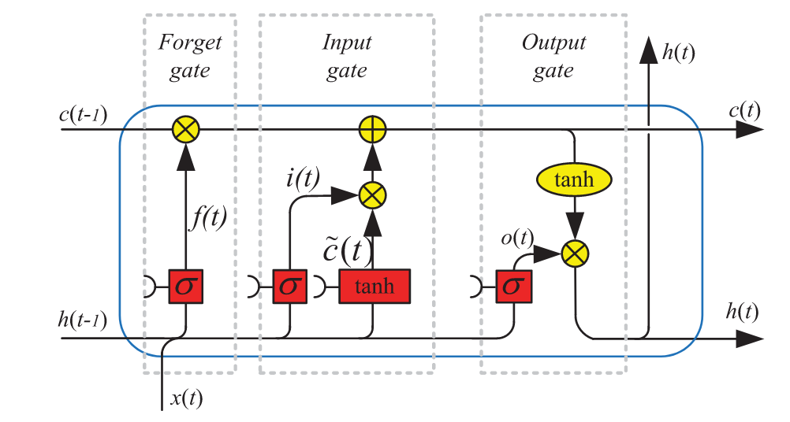

# Methods
\setcounter{page}{27}
## Model Specifications

In the following section, the model specifications and the training and 
validation procedures are outlined. The core model of this thesis consists
of a Convolutional-Long-Short-Term-Memory Neural Network (CNN-LSTM). However,
as a baseline reference to asses the CNN-LSTM performance, a standard logistic 
regression model (LR) is also constructed. Starting from the LR model, relevant
concepts for the establishment of the training architecture are introduced.

### Logistic Regression

LR models have been the standard in conflict research for some time.
One advantage of regression models is that the model outcome is easy to interpret
by humans, which is of primary importance when research results are used
to inform policy decisions. Recently, @halkia2020a published the methodology for
the GCRI developed for the European Union Conflict Early Warning
System which is based on LR. Their model outperforms or achieves
comparable accuracy metrics compared to several conflict prediction tools 
based on more complex modeling procedures. This indicates that a LR
model constitutes a viable choice to compare it with the results of more 
advanced modeling techniques such as neural networks. 
A binomial LR predicts the probability of an observation belonging to
either one of two categories of a dichotomous dependent variable based on a number
of independent variables following Equation \@ref(eq:logit).

\begin{equation}
P(Y) = \frac{e^\gamma}{1+e^\gamma}; \gamma = \beta_0 + \beta_1x_1 + \beta_2x_2 + ... +\beta_nx_n
(\#eq:logit)
\end{equation}

In this form, $P(Y)$ will take a value between 0 and 1 and represents the probability
of a conflict occurrence. $x_1 ... x_n$ represent the predictor variables while
$\beta_0 ... \beta_n$ represent the model coefficients to be fitted.
From the equation, it becomes evident that logistic regressions assume a linear 
relationship between the predictors and the response variable. Secondly,
LR is not intrinsically designed to handle a time axis, even though
one could include time as an additional independent variable. It also means that
LR can only produce one output at a time for each observation. 
If one wants to predict conflict for several months into the future, a specific model
must be trained for each month in the prediction horizon. 

Additionally, LR models are highly sensitive to class imbalances
in the training data set. Conflict prediction is a classification task with a 
very high class imbalance (Table \@ref(tab:02-data-response-dist)). 
Various techniques exist to cope with class imbalance [@ali2015].
One among them which has been previously used in conflict research is downsampling [@hegre2019].
Here, before fitting the model, the majority class, which is represented by 
non-conflict district-months, is randomly downsampled to match the size of the minority 
class. This balanced subset is then used to fit the model parameters. 
Metric evaluations can be applied on a hold-out test data set, characterized by 
the original imbalanced distribution between conflict and non-conflict district months. 
The procedure to map the probabilistic model output to a binary classification 
follows Equation \@ref(eq:proba):

\begin{equation}
\hat{Y} = 
\begin{cases} 
1 & \text{if } P(Y) \geq \lambda \\ 
0 & \text{otherwise}
\end{cases}
(\#eq:proba)
\end{equation}

Here, $\lambda$ is a threshold value usually selected to be $0.5$. However,
specifically in modeling tasks with a high class imbalance such as conflict 
prediction, an optimal threshold might be searched for a given accuracy metric -
a process referred to as threshold tuning [@zou2016].

### CNN-LSTM

#### Basic Concepts of Neural Networks.

Before explaining the fundamentals of CNN-LSTMs, a first step is to define the
modeling task which might guide the reader through the descriptions to follow.
In the present case, the modeling task is one of a multivariate time series 
prediction with a multi-step prediction horizon. The available training data
set can be formally described as in Equation \@ref(eq:data),

\begin{equation}
X_t^L= x_t^1,x_{t+1}^1...,x_{t-N+1}^1,...\ ..., x_t^L,...,x_{t-N+1}^L
(\#eq:data)
\end{equation}

where $X_t^L$ is the predictor matrix with $L$ predictors and $t$ available
timesteps. The training process then comprises the search for a function 
$f(X_t^L)$ which maps the input features to a multi-step prediction vector following
Equation \@ref(eq:pred),

\begin{equation}
\hat{Y} = f(X_t^L) = {\hat{y}_{t+1},\hat{y}_{t+2},...,\hat{y}_{t+h}}
(\#eq:pred)
\end{equation}

where $\hat{Y}$ is the predicted outcome vector of $h$ time steps into the future.
Commonly, the modeling function is trained on equal length inputs, 
such as the last 24 hours for energy price forecasting [@cordoni2020],
the last week in the case of particle matter concentration forecasting [@li2020],
or even several years worth of data in the case of solar irradiance and photovoltaic
power prediction [@rajagukguk2020]. However, sophisticated deep learning models
are also able to model variable-length inputs to variable-length outputs, i.e., in 
the case of language translation models [@yang2020].

The most fundamental concept in neural networks is that of a single neuron. This neuron
receives some inputs $X$, learns a weight matrix $W$ which then is used for a 
multiplicative interaction with the inputs, and an additional bias term $b$ is added.
The final output $\hat{Y}$ is obtained by passing the results of this interaction 
through a possibly non-linear activation function, also called activation 
function, here represented by a $\sigma$-function \@ref(eq:neuron):


\begin{equation}
\hat{Y} = \sigma \Big(WX+b \Big).
(\#eq:neuron)
\end{equation}

These predicted outcomes can be used to calculate the error in comparison
to the observed outcomes based on a specific loss function also referred to as 
cost function $C$. In a general notation, 
a given loss function calculates the loss between predicted and observed values 
which in itself is a function of the weights, the bias, the activation function
and the inputs and observed values based on Equation \@ref(eq:loss):

\begin{equation}
Loss = C(Y-\hat{Y}) = C(W b \sigma X Y).
(\#eq:loss)
\end{equation}

The loss is used to adjust the weight matrix $W$ and the bias term $b$ to more 
precisely match the expected outputs. This is achieved through a process called 
backpropagation. It is the process governing how a network _learns_ to optimize 
the model function from Equation \@ref(eq:pred). To apply backpropagation,
partial derivatives of the loss function in relation to its components are calculated
from the output towards the inputs. This way, the gradient of change in the loss 
conditioned by the single components can be estimated. The gradients' calculation 
is not included in detail for brevity. However, a comprehensive explanation of 
the process can be found in @parr2018. 

\newpage 

In relation to the weight matrix $W$, the gradients are defined by the partial 
derivatives of the loss in relation to the single weights according to Equation 
\@ref(eq:back):

\begin{equation}
\nabla{C_{W}} = 
\begin{bmatrix} \frac{\partial{C}}{\partial{w_1}} \\ 
\frac{\partial{C}}{\partial{w_2}} \\ 
\vdots \\ 
\frac{\partial{C}}{\partial{w_n}} 
\end{bmatrix}
(\#eq:back)
\end{equation}


The gradients are used to update the weight matrix in the direction 
the loss function is suspected to decrease most rapidly following Equation \@ref(eq:lr)

\begin{equation}
W^* = W - \eta \nabla{C_{W}},
(\#eq:lr)
\end{equation}

where $\eta$ is a constant steering how much the weight matrix is adjusted in the
gradients' direction referred to as learning rate, and $W^*$ is the adjusted weight matrix. 
The same principle applies to the bias term. It should be noted that the process 
of backpropagation described here is simplified to a single-layer network. For 
multi-layer networks, the error terms have to be backpropagated from one layer to 
the next, in the direction from the output layer towards the input layer. However, the general concept 
remains the same. In this context, it is essential to differentiate between
different training strategies which differ from each other mainly by the fact 
when gradients are calculated, and weights are adjusted during training.
The first is called batch gradient descent. Here the gradients are calculated on
based on all available observations. Once all training samples have been
passed through the network, the cost function evaluates the loss and the errors
are then backpropagated to adjust the weight matrix and bias terms. 
The second strategy is referred to as stochastic gradient descent or online learning,
where a backpropagation takes place for every single sample.
The last one is called mini-batch gradient descent and is the most widely used 
strategy. Based on a pre-defined batch size, the training data set is separated 
into equally sized batches. Backpropagation is then applied once a batch has been 
passed through the network. Additionally, several functions governing the 
adaptation process exist. They are referred to as optimizers and they mainly differ in 
the way the learning rate is adapted during the training process. An analysis
of these differences is out of this thesis' scope, and the reader is referred
to @sun2019 for a comprehensive overview.

\newpage 

#### Convolutional Neural Networks.

In contrast to the simple neural network structure explained in the section
above, CNNs work by applying a convolution kernel to the inputs. This operation 
effectively summarizes the input values based on a specific number of different kernels
with a shared kernel width (Figure \@ref(fig:03-methods-cnn)). This behavior of
CNNs made them most attractive to tasks involving 2D-data such as image classification
[@krizhevsky2017] or the analysis of remote sensing imagery [@song2019].
Despite this traditional usage, CNNs successfully have been employed with 1D data
structures with a time-component such as audio signals [@lee2009], activity detection
and heart failure [@zheng2014] or stock price forecasting [@mehtab2020a].

```{r 03-methods-cnn, fig.scap="Scheme of a 1D convolution operation.", fig.cap="Scheme of a 1D convolution operation for a specific kernel k with width $\\beta = 3$. Yellow squares indicate the current convolution at $t=4$."}
bracket_text = tibble(x=4, y=5.8 , text=TeX("$\\beta = 3$"))
kernel = tibble(x = c(3:5), y = rep(5.5,3), text = TeX(paste("$w_{k,", 1:3, "}$", sep="")))
arrow = tibble(x=5.6, y=5.5, xend=6.5, yend=5.5)
points = tibble(x = 4.5, y = c(2.7,2.5,2.3))
anno_left = tibble(x=rep(-1,5), y = c(5.5,4.5, 3.5, 1.5, 0), text = TeX(c("$W_k$", "$L_1$", "$L_2$", "$L_i$", "$X^*_k$")))
input_1 = tibble(x = c(0:9), y = rep(4.5, 10), group = factor(c(0,1,1,2,2,2,rep(1,4)),
                                                              label = c("0","1","2","3","4"),
                                                              levels = 0:4),
                 text = c("0", TeX(paste("$x_", 1:7, "$", sep="")),"...", TeX("$x_t$")))

input_2 = tibble(x = c(0:9), y = rep(3.5, 10),  group = factor(c(0,1,1,2,2,2,rep(1,4)),
                                                               label = c("0","1","2","3","4"),
                                                               levels = 0:4),
                 text = c("0", TeX(paste("$x_", 1:7, "$", sep="")),"...", TeX("$x_t$")))

input_3 = tibble(x = c(0:9), y = rep(1.5, 10),  group = factor(c(0,1,1,2,2,2,rep(1,4)),
                                                               label = c("0","1","2","3","4"),
                                                               levels = 0:4),
                 text = c("0", TeX(paste("$x_", 1:7, "$", sep="")),"...", TeX("$x_t$")))

output = tibble(x = c(1:9), y = rep(0, 9), group = factor(c(3,3,3,2,rep(4,5)),
                                                          label = c("0","1","2","3","4"),
                                                          levels = 0:4),
                text = c(TeX(paste("$y_{k,", 1:4, "}$", sep="")), rep("",5)))

ggplot() +
  annotate(geom="text", x=4, y=6.5, label=TeX("$\\beta = 3$"), size=5, parse=TRUE)+
  # annotate(geom="text", x=4, y=6, label=TeX("$\\{$"), parse=TRUE, angle=-90, size=50)+
  geom_rect(data=kernel, aes(xmin=x-.5, xmax=x+.5, ymin=y-.4, ymax=y+.4), 
            fill = "#E6AB02",color = "black") +
  geom_text(data=kernel, aes(x=x, y=y, label=text), 
            parse=T, size=4.5) +
  geom_segment(data=arrow, aes(x=x,y=y,xend=xend,yend=yend), 
               arrow = arrow(length=unit(0.5,"cm")), size = 1) +
  geom_rect(data=input_1, aes(xmin=x-.5, xmax=x+.5, ymin=y-.4, ymax=y+.4, fill=group), 
            color = "black", show.legend = F) +
  geom_text(data=input_1, aes(x=x,y=y,label=text), parse=T, size=4.5) +
  geom_point(data=points, aes(x=x,y=y)) +
  geom_rect(data=input_2, aes(xmin=x-.5, xmax=x+.5, ymin=y-.4, ymax=y+.4, fill=group), 
            color = "black", show.legend = F) +
  geom_text(data=input_2, aes(x=x,y=y,label=text), parse=T, size=4.5) +
  geom_rect(data=input_3, aes(xmin=x-.5, xmax=x+.5, ymin=y-.4, ymax=y+.4, fill=group), 
            color = "black", show.legend = F) +
  geom_text(data=input_3, aes(x=x,y=y,label=text), parse=T, size=4.5) +
  geom_rect(data=output, aes(xmin=x-.5, xmax=x+.5, ymin=y-.4, ymax=y+.4, fill=group),
            color = "black", show.legend = F) +
  geom_text(data=output, aes(x=x,y=y,label=text), parse=T, size=4.5) +
  geom_text(data=anno_left, aes(x=x,y=y,label=text), parse=T, size=6) +
  scale_fill_manual(values=c("#999999","#7570B3","#E6AB02","#1B9E77","transparent")) +
  theme_classic() +
  ylim(-1,7) +
  labs(x=NULL, y=NULL)+
  theme(line = element_blank(),
        text = element_blank())
```

Figure \@ref(fig:03-methods-cnn) is an exemplary convolution operation for a specific
kernel $k$ with the kernel width $\beta=3$. The input matrix $X$ consists of $L_i$ 
individual predictors with $t$ time steps. The computation of the output involves 
sliding the kernel window $W_k$ along the time axis. At the edges of the time series, 
there is not enough data for the convolution operation. One way to overcome this 
limitation is called zero-padding.
A value of 0 is assumed for unavailable data, indicated by the gray boxes on the left. 
Another method, which would eventually alter the size of the time axis, 
is to simply drop the observations for which no calculation with the kernel width $\beta$ 
is possible. This behavior is leveraged in many applications to effectively
reduce the size of the data sequence at higher abstraction levels within the
network, e.g., in applications of CNNs in image recognition [@krizhevsky2017]. 
The individual outputs $y_{k,t}$ are obtained by summing 
up the products of the inputs and the weights within the kernel window, indicated 
by the yellow boxes. The weights of $W_k$ remain the same for one kernel but
not across different kernels. Note that the result of the operation was denoted 
$X^*_k$ to indicate it is an intermediate output, so one does not confuse it with 
the final network output $\hat{Y}$. Convolutional layers rarely represent the 
final layer in a network. It is prevalent to stack multiple convolutional 
layers on top of each other so that the outputs of the first are used as the inputs 
to the next [@rawat2017]. For this reason, a given 1D convolutional layer at position $l$ within the network
and an input $X^{l-1}$ is defined by Equation \@ref(eq:cnn),

\begin{equation}
X^l_\beta = \sigma \Big( \sum\limits^L_{i=1} X^{l-1}_i \cdot k^l_{i\beta} + b^l_{i\beta} \Big)
(\#eq:cnn)
\end{equation}

where $k$ is the number of kernels, $\beta$ indicates the size of the filter kernels,
$L$ is the number of input features in $X^{l-1}$, the bias is represented with $b$,
$\sigma$ is an activation function and $(\cdot)$ represents the convolutional operation
explained in Figure \@ref(fig:03-methods-cnn). In practice, convolutional layers are often combined with so-called pooling layers, 
which combine the advantages of further reducing the dimensionality of the inputs and 
extracting latent patterns in the data [@rawat2017]. The pooling layers exist in two favors,
namely average and maximum pooling. It requires the specification of a pooling
window, like the kernel window in the convolutional layer, which will then 
be applied over the input data to generate the average or maximum value of the observation
window. A difference to the convolution kernel is that the pooling will be applied
to each kernel individually and that most commonly, the pooling windows will be 
non-overlapping. Again, by using a zero-padding strategy, the shortening of the time series can be averted.

\newpage

#### Long Short-Term Memory Network.

The basic building block of LSTMs is recurrency. In deep learning, this is implemented
by a simple recurrent cell which is defined by Equation \@ref(eq:rnn-cell).

\begin{equation}
Y_t = h_t; h_t = \sigma \Big( W_h h_{t-1} + W_xX_t + b \Big)
(\#eq:rnn-cell)
\end{equation}

Here, the recurrent information, also referred to as hidden state, $h_t$ is defined
by the previous hidden state $h_{t-1}$, the current input $X_t$ and the associated
learnable weights $W_{h}$, $W_x$ and the bias $b$. $\sigma$ is an activation function.
That way, recurrent networks have information from earlier time steps available 
when $X_t$ is processed. However, long-term dependencies in the input sequence are 
not very well captured by this simple recurrent cell because of the 
exploding or vanishing gradient problem [@yu2019]. To capture long-term dependencies 
in the data, @hochreiter1997 proposed an extension to the 
simple recurrent cell referred to as Long Short-Term Memory cell, which was 
later modified to today's most common LSTM architecture by @gers2000.

```{r 03-methods-lstm, fig.scap="Scheme of a Long Short-Term Memory cell.", fig.cap="Scheme of a Long Short-Term Memory cell. (Source: Yu et al. (2019))", out.width="80%", fig.pos="H"}

```

Figure \@ref(fig:03-methods-lstm) depicts the inner structure of a LSTM cell. The input
data flows from left to right. There are two inputs to the cell, namely the inputs
$x_t$ as well as $h_{t-1}$, similar to the basic recurrent cell. The difference is 
found _within_ the LSTM cell, where red boxes represent so-called gates which are functions 
with trainable parameters controlling the information flow inside the cell.
The cell state $c_{t-1}$ moves from left to right on the top of the box.
At the first intersection, the cell state is updated by a point-wise multiplication 
with the result of $\sigma(h_{t-1}x_t)$, which is either 0 or 1 for specific locations. 
This gate governs which parts of the cell state are set to 0, which is why one refers 
to it as the forget gate $f(t)$. 
The second gate is slightly more complex. First, another variant with individual weights 
of $\sigma(h_{t-1}x_t)$ is calculated. Then a point-wise multiplication with 
$\widetilde{c}(x_t)$ determines which new information is added linearly 
to the cell state. Because new information is added to the cell state, this gate 
is referred to as the input gate. 
At the final gate, referred to as the output gate $o(t)$, another multiplicative 
interaction with the updated cell state and the input determines the cell
output $h_t$. Additionally, the new cell state $c_t$ is an output, both of which 
will be used in the next step of an unfolded LSTM to process the input at $x_{t+1}$. 
Mathematically, such an LSTM cell is defined by the following equations:

\begin{equation}
\begin{aligned}
& f(t) = \sigma (W_{fh} h_{t-1} + W_{fx}x_t + b_f), \\
& i(t) = \sigma (W_{ih} h_{t-1} + W_{ix}x_t + b_i), \\
& \widetilde{c}(t) = tanh(W_{\widetilde{c}h} h_{t-1} + W_{\widetilde{c}x}x_t + b_{\widetilde{c}}), \\
& c(t) = f(t) \cdot c_{t-1} + i(t) \cdot \widetilde{c}_t, \\
& o(t) = \sigma (W_{oh} h_{t-1} + W_{ox}x_t + b_0), \\
& h_t = o_t \cdot tanh(c_t).
\end{aligned}
(\#eq:lstm-cell)
\end{equation}

A common regularization strategy to reduce the tendency to overfit the training
data is to include dropout layers after an LSTM layer. The dropout layer randomly
silences a specific percentage of the neurons in a LSTM, thus directing each 
neuron's learning process towards learning more general features in the
input sequence. Also, multiple LSTM layers can be stacked on top of each other,
similar to CNNs, so that the first layer's output will be used as the input
to the next. 
LSTMs have
been reported to achieve considerable results in various problem fields for their 
capacity to capture both long and short-term dependencies. Researchers
from Google achieved a high accuracy by using a LSTM in a sequence-to-sequence problem
in machine translation [@wu2016]. Other use cases are the prediction of stream flows
in rivers [@hu2020], estimates of monthly rainfall [@chhetri2020], or predicting
the occurrences of armed conflict in India [@hao2020a].

\newpage

#### Model architecture.

The proposed model leverages both CNNs and LSTMs by combining them
in a multi-input model. CNNs are used at the top of the model in 
order to yield representative feature map encodings of the high-dimensional 
conditions of a district and its spatial neighborhood. There are four parallel 
branches in the network for the model to pick up differences between a district 
and its buffer zones. Each of these branches processes the available predictors for the 
respective zone, i.e., the district or its buffers. Figure \@ref(fig:03-methods-arch) 
shows one such branch as an example for the network architecture. Note that all four
branches follow the same concept but that the specific architecture, i.e., the
number of layers and neurons is determined during a hyperparameter optimization 
explained in the following section. 

The first component of a branch consists of a 1D-CNN based on zero-padding
that a second CNN layer can follow before the signal goes through a local pooling layer that
averages or maximizes a sequence based on a temporal window determined by 
the pool size. Note that because the network is fed with variable-length input
sequences, explained in detail in Section \@ref(training-validation-process), 
a global pooling operation is necessary before the LSTM layers. For equal
length input sequences, a flattening layer is typically used to flatten
the time sequence to one dimension. With variable-length inputs, this would result
in different output sizes, which the LSTM layers could not process. Thus,
the global pooling layer reduces the input sequences to the number of kernels in 
the previous layer. This reduction is then repeated $h$ times according to the desired 
prediction horizon and fed into a sequence of a maximum of three LSTM layers 
coupled with individual dropout layers.

Because this general network structure is applied to a total of four different
inputs, the network will produce four distinct sequences.
These sequences represent what the network has learned from the
input data for each of the buffer zones. They are concatenated and put 
through a small, fully connected model with three layers to retrieve a single 
output. Each of these layers shares the same activation function and number 
of neurons. Since each neuron is fully connected to every neuron in the next layer, 
this part of the model is referred to as a fully connected model. Figure \@ref(fig:03-methods-fc) 
shows the model structure from the concatenation of the four input sequences to 
the final output. The final layer only has one neuron but is time distributed so that 
it outputs a single value for every time step in the prediction horizon, which is 
set here to 12 months. For its activation function, it must output values between 
0 and 1 so that it can be interpreted as a probability for the occurrence of 
conflict, which can be mapped to a specific prediction following Equation \@ref(eq:proba).

\newpage

```{r 03-methods-arch, fig.cap="Proposed architecture of a single CNN-LSTM branch. Bold lines indicate mandatory layers, dashed lines indicate potential layers which are determined together with other parameters during a hyperparamter optimization process.", fig.scap="Proposed architecture of a single CNN-LSTM branch.",fig.height=9, fig.width=5}

cnn <- tibble(x = c(5, 5, 5, 5, 5) ,
              y = c(10, 9, 8, 7, 6),
              text = c("**1-D CNN Layer**",
                       "**1-D CNN Layer**",
                       "**Local Pooling**",
                       "**Global Pooling**",
                       "**Repeat Layer**"),
              specs = c(TeX("$number \\, of \\, kernels: \\; k_1 \\; kernel width: \\; \\beta_1 \\; activation: \\; a_1$"),
                        TeX("$number \\, of \\, kernels: \\; k_2 \\; kernel width: \\; \\beta_2 \\; activation: \\; a_2$"),
                        TeX("$pooling \\, operation: \\; pool_1  \\; pool size:    \\; pool-size$"),
                        TeX("$pooling \\, operation: \\; pool_2$"),
                        TeX("$number \\, of \\, repeats: \\; h = 12$")),
              group = as.factor(c(1, 2, 1, 1, 1)) # 1: mandatory, 2: possible
)
arrows_cnn <- tibble(x = c(5,5,5,5),
                     y = c(9.7, 8.7, 7.7, 6.7),
                     xend = c(5,5,5,5),
                     yend = c(9.4, 8.4, 7.4, 6.4) 
)

lstm <- tibble(x = c(5,5,5,5,5,5),
               y = c(5,4,3,2,1,0),
               text = c(
                 "**LSTM Layer**",
                 "**Dropout**",
                 "**LSTM Layer**",
                 "**Dropout**",
                 "**LSTM Layer**",
                 "**Dropout**"),
               specs = c( 
                 TeX("number of neurons: $n_1$"),
                 TeX("dropout rate: $d_1$"),
                 TeX("number of neurons: $n_2$"),
                 TeX("dropout rate: $d_2$"),
                 TeX("number of neurons: $n_3$"),
                 TeX("dropout rate: $d_3$")),
               group = as.factor(c(1,1,2,2,2,2))
)

arrows_lstm <- tibble(x = c(5,5,5,5,5,5),
                      y = c(5.7, 4.7, 3.7, 2.7, 1.7, 0.7),
                      xend = c(5,5,5,5,5,5),
                      yend = c(5.4, 4.4, 3.4, 2.4, 1.4, 0.4) 
)


ggplot()+
  geom_rect(data = cnn, aes(xmin=x-2, xmax=x+2, ymin=y-.25, ymax=y+.35, linetype=group),
            fill=NA, show.legend = F, color = "black") +
  geom_richtext(data=cnn, aes(x=x,y=y+.18,label=text),  fill = NA, label.color = NA) +
  geom_text(data=cnn, aes(x=x,y=y-.1,label=specs), size=3, parse = T) +
  geom_segment(data=arrows_cnn, aes(x=x,y=y,xend=xend,yend=yend), 
               arrow = arrow(length=unit(0.3,"cm")), size = 1) +
  geom_rect(data = lstm, aes(xmin=x-2, xmax=x+2, ymin=y-.25, ymax=y+.35, linetype=group),
            fill=NA, show.legend = F, color = "black") +
  geom_richtext(data=lstm, aes(x=x,y=y+.18,label=text),  fill = NA, label.color = NA) +
  geom_text(data=lstm, aes(x=x,y=y-.1,label=specs), size=3, parse = T) +
  geom_segment(data=arrows_lstm, aes(x=x,y=y,xend=xend,yend=yend), 
               arrow = arrow(length=unit(0.3,"cm")), size = 1) +
  theme_classic() +
  labs(x=NULL, y=NULL)+
  theme(line = element_blank(),
        text = element_blank())

```

\newpage

```{r 03-methods-fc, fig.cap="Proposed architechture of the fully connected output model.", fig.width=5, fig.height=4}
fc <- tibble(x = c(5, 5, 5, 5, 5) ,
             y = c(10, 9, 8, 7, 6),
             text = c("**Concatentation Layer**",
                      "**Fully Connected Dense Layer**",
                      "**Fully Connected Dense Layer**",
                      "**Fully Connected Dense Layer**",
                      "**Time Distributed Dense Layer**"),
             specs = c(TeX("$number\\,of\\,input\\,sequences:\\;4$"),
                       TeX("$number\\,of\\,neurons:  \\; n_{dense}  \\; \\; activation:  \\; a_{dense}$"),
                       TeX("$number\\,of\\,neurons:  \\; n_{dense}  \\; \\; activation:  \\; a_{dense}$"),
                       TeX("$number\\,of\\,neurons:  \\; n_{dense}  \\; \\; activation:  \\; a_{dense}$"),
                       TeX("$number\\,of\\,neurons:  \\; 1   \\;\\; activation:  \\; a_{out}  \\; bias \\, initialization: \\; \\pi$")),
             group = as.factor(c(1, 1, 1, 1, 1)) # 1: mandatory, 2: possible
)

arrows_fc <- tibble(x = c(5,5,5,5),
                    y = c(9.7, 8.7, 7.7, 6.7),
                    xend = c(5,5,5,5),
                    yend = c(9.4, 8.4, 7.4, 6.4) 
)

ggplot()+
  geom_rect(data = fc, aes(xmin=x-2, xmax=x+2, ymin=y-.25, ymax=y+.35, linetype=group),
            fill=NA, show.legend = F, color = "black") +
  geom_richtext(data=fc, aes(x=x,y=y+.18,label=text),  fill = NA, label.color = NA) +
  geom_text(data=fc, aes(x=x,y=y-.1,label=specs), size=3, parse = T) +
  geom_segment(data=arrows_fc, aes(x=x,y=y,xend=xend,yend=yend), 
               arrow = arrow(length=unit(0.3,"cm")), size = 1) +
  theme_classic() +
  labs(x=NULL, y=NULL)+
  theme(line = element_blank(),
        text = element_blank())
```


As mentioned before, the outcome variable is characterized by a very high
class imbalance (Table \@ref(tab:02-data-response-dist)). In traditional approaches,
researchers have counterbalanced this fact by artificially altering the distribution 
during training [@halkia2020a; @schellens2020]. Using downsampling approaches, 
however, means that there is a reduction in available training data. Because of 
the relatively short available sequences and a low number of observations, 
downsampling was not conducted when training the neural network. Instead, a 
specialized loss function was used to differentiate between easy-to-learn examples, 
referred to as the background class, and hard-to-classify examples also called foreground class. 
This function is called focal loss and was initially designed to detect rare objects in 
image segmentation tasks [@lin2018]. As indicated, the focal loss down-weights the
contribution of easy-to-classify examples to the overall loss, thus directing the
training process towards optimizing for hard-to-classify examples. It is defined
mathematically by Equation \@ref(eq:floss)

\begin{equation}
\begin{aligned}
& p_t = 
\begin{cases} 
p & \text{if } y = 1 \\ 
1-p & \text{otherwise} 
\end{cases} \\
& FL(p_t) = -\alpha(1-p_t)^{\gamma} \, log(p_t) ,
\end{aligned}
(\#eq:floss)
\end{equation}

where $p$ is the probability estimation for an observation outputted by the model,
$\alpha$ is a weighting factor that attributes different weights to the background and 
foreground class and $\gamma$ is a parameter governing the magnitude with which
easy examples are down-weighted. The original authors state that this 
loss function has two beneficial properties for contexts with high class imbalance.
The first is that for an observation wrongly classified as the background 
class, while $p_t$ is small, the loss remains nearly unaffected because the modulating
factor $(1-p_t)^{\gamma}$ tends towards 1. However, when $p_t\rightarrow1$, the term
goes towards 0, which means that the contribution of well-classified examples is 
weighted down. The second property is that the focusing parameter $\gamma$
leans itself to adjusting the rate at which easy examples are down-weighted based
on the problem at hand. When $\gamma = 0$, the loss is equal to cross-entropy 
loss, i.e., all examples contribute equally to the overall loss. Both $\alpha$ and
$\gamma$ are parameters that are optimized during the hyperparameters
optimization stage. Additionally, the authors initiate the final output layer with 
a small value $\pi$, effectively reducing the probability the network will estimate
the occurrence of the foreground class during the early stages of training. They report
that this has positive impacts on training stability in high class imbalance 
scenarios [@lin2018]. This initialization bias is also determined during the 
optimization stage.

## Bayesian Hyperparameter Optimization

Hyperparameters are not directly involved in predicting a particular output, so 
they are often contrasted with model parameters. They substantially influence 
the overall training process and the accuracy of the predictions [@albahli2020]. 
Table \@ref(tab:03-methods-hyperparas-choices) summaries the notation of hyperparameters 
and the associated value ranges. Note that the branch-specific hyperparameters will
be optimized for the four different branches in the network corresponding to 
the districts and the three buffer zones. Various strategies to apply hyperparameter 
optimization exist. Among the most widely used are grid search, random search, 
Bayesian Optimization (BO), and more recently the training of machine-learning 
models to predict the accuracy of different model configurations, also called 
meta-learning [@baik2020; @yu2020]. 

\newpage

```{r 03-methods-hyperparas-choices}

hyperparas <- tibble(name = c("lstm\\_layers",
                              "double\\_cnn",
                              "a_{cnn}",
                              "k_{cnn}",
                              "\\beta_{cnn}",
                              "pool_1",
                              "pool\\_size",
                              "pool_2",
                              "n_{1}",
                              "d_{1}",
                              "n_{2}",
                              "d_{2}",
                              "n_{3}",
                              "d_{3}",
                              "a_{dense}",
                              "n_{dense}",
                              "a_{out}",
                              "\\pi",
                              "\\alpha",
                              "\\gamma",
                              "opti",
                              "lr"),
                     descr = c("Number of LSTM Layers",
                               "Use of a second CNN layer",
                               "Activation function for CNN layers",
                               "Number of kernels in CNN layers",
                               "Kernel width for CNN layers",
                               "Pooling operation for local pooling",
                               "Pool size for local pooling",
                               "Pooling operation for global pooling",
                               "Number of neurons in first LSTM layer",
                               "Rate of dropout in first LSTM layer",
                               "Number of neurons in second LSTM layer",
                               "Rate of dropout in second LSTM layer",
                               "Number of neurons in third LSTM layer",
                               "Rate of dropout in third LSTM layer",
                               "Activation of the dense model",
                               "Neurons per layer in the dense model",
                               "Activation of the output layer",
                               "Value of bias initialization of output layer",
                               "Alpha parameter of focal loss function",
                               "Gamma parameter of focal loss function",
                               "Optimizer function",
                               "Learning rate of the optimizer function"),
                     values = c("1-3",
                                "Yes, No",
                                "\\makecell[cl]{sigmoid, hard\\_sigmoid, softmax,\\\\softplus, softsign}",
                                "12-128",
                                "3-24",
                                "maximum, average",
                                "3-24",
                                "maximum, average",
                                "12-128",
                                "0-0.5",
                                "12-128",
                                "0-0.5",
                                "12-128",
                                "0-0.5",
                                "\\makecell[cl]{sigmoid, hard\\_sigmoid, softmax,\\\\softplus, softsign, relu,\\\\elu, selu, tanh}",
                                "12-128",
                                "sigmoid, hard\\_sigmoid, softmax",
                                "0-1",
                                "0-1",
                                "0-10",
                                "\\makecell[cl]{rmsprop, adam, adadelta,\\\\adagrad, adamax, sgd}",
                                "1^{-10} - 1"))

hyperparas$name = paste("$", hyperparas$name, "$", sep = "")
hyperparas$values = paste("$", hyperparas$values, "$", sep = "")

hyperparas %>% 
  rename(Name = name, Description = descr, 'Value Ranges' = values) %>% 
  thesis_kable(linesep = c(""),
        align = "lll",
        caption = c("Overview of model hyperparameters."),
        escape = F,
        longtable = T) %>% 
  kable_styling(latex_options = c("HOLD_position", "repeat_header"),
                font_size = 10) %>%
  group_rows("Branch specific hyperparameters", 1, 14) %>%
  group_rows("Global hyperparameters", 15, 22) %>%
  footnote(general = "Branch specific parameters are optimized individually for the 0/50/100/200 km input branches. Global parameters are optimized once per model.",
           threeparttable = T,
           escape = FALSE,
           general_title = "General:",
           footnote_as_chunk = T)

```

\newpage

Different approaches have in common what @shahriari2016 called "taking the human out of the loop." 
Hyperparameter tuning in this way can be understood as a process of reducing the 
impact of a researcher's subjectivity on the model construction towards the 
machine and the data controlling the training process. 
In its most extreme form, this thought leads towards machines being able to 
determine how they can learn a specific problem by themselves [@yao2019a].
The approaches, however, differ in complexity and the way they cope with the
problem to balance between search time and accuracy. For example, grid search 
might yield equally high accuracies but the training time needed to achieve these
can be very high compared with BO [@wu2019]. 
While the meta-learning approach certainly is beyond this thesis's scope, an
optimization strategy was searched with a reasonable balance between computing
efficiency in terms of time and high accuracy. The choice was made to apply
BO because it explicitly leverages prior information on the performance of
hyperparameters to determine the next set to be explored and has a proven
record of delivering robust results since its original publication in the 1970s
[@mockus2014]. In essence, BO works by iteratively updating the beliefs on
the distribution of an accuracy metric for an objective function $f$ based on the
knowledge of prior samples of parameter $x$. The goal is to find the global maximum 
for $x^+$ within a pre-defined search space $A$ following Equation \@ref(eq:opti)

\begin{equation}
x^+ = arg\;\underset{x \in A}{max} \, f(x).
(\#eq:opti)
\end{equation}

This is achieved by updating the prior probability $P(f(x))$ given data $D$ to 
get the posterior probability $P(f(x)|D)$, which is referred to as the Bayes' 
theorem [@bayes1763]. Assume that we have accumulated a dataset 
$D_{1:t-1} = [(x_1,y_1) \dots (x_{t-1},y_{t-1})]$ where $x_1$ is the value of a 
hyperparameter at trial $t = 1$ and $y_1$ is the result of the objective function 
$y_1 = f(x_1)$ which, in the case at hand, is the performance of the proposed model 
measured by a specific accuracy metric. This knowledge data can be queried by an 
acquisition function $u$ to retrieve the next promising candidate $x_t$ following 
Equation \@ref(eq:acqu)

\begin{equation}
x_{t} = arg \;\underset{x}{max} \, u(x|D_{1:t-1})
(\#eq:acqu)
\end{equation}

With this candidate at hand the model is retrained to obtain an additional
measurement on the performance. The knowledge data set is updated by 
$D_{1:t} = \{D_{1:t-1},(x_t,y_t)\}$ and a new posterior probability for $f(x)$ 
can be estimated.
BO works by calculating the probability density function for a given parameter 
$x$ based on a Gaussian process. The details of these calculations are beyond
this thesis's scope, but the reader is referred to @rasmussen2006 for a
comprehensive analysis of its application in machine learning. As an acquisition
function, the Upper Confidence Bound (UCB) function was used to calculate the next
candidate parameter $x_t$. For a comprehensive overview of a BO process using 
UCB be referred to [@srinivas2012]. It should be noted that BO, in its essence, is
a sequential problem because the results of one iteration will impact the next.
Even though there have been efforts to parallelize BO [@nomura2020], these 
approaches do not alter the basic sequential characteristic of the algorithm and
come with higher management costs for the researcher.

## Performance Metrics
\setcounter{page}{41}

The performance of a model is validated on a specific set of accuracy
metrics. However, performance is often a multi-dimensional problem, which is why
several metrics are used in this thesis. These were selected to
represent different dimensions of a model's performance to differentiate between
the occurrence of conflicts versus peace.

In its essence, the problem of this thesis is one of a binary classification.
The core component for the performance assessment of a binary classification 
problem is a simple two-class confusion matrix depicted in Table \@ref(tab:03-methods-conf) 
[@tharwat2020].

```{r 03-methods-conf}

cnf <- tibble(col1 = c("", "\\textit{Positives}", "\\textit{Negatives}"),
              col2 = c("\\textit{Positives}", "True Positives (TP)", "False Negatives (FN)"),
              col3 = c("\\textit{Negatives}", "False Positives (FP)", "True Negatives (TN)"))

thesis_kable(cnf, 
      col.names = c("","", ""),
      align = "ccc",
      escape = F,
      caption = "Concept of a binary confusion matrix.") %>%
  kable_styling(latex_options = c("HOLD_position", "repeat_header"),
                font_size = 10) %>%
  add_header_above(c("", "Observation" = 2), bold = T) %>%
  group_rows("Prediction", 2,3)

```

From the table above, it is evident that there are two types of errors. 
False Positives (FP), also referred to as Type I error, 
are observations that were falsely classified as the positive class while in
reality they belong to the negative class. False Negatives (FN), referred to
as the Type II error, are observations that were predicted as the negative
class, however, they belong to the positive class [@tharwat2020].
The most widely used accuracy metric derived from a confusion matrix
is Overall Accuracy (OA). It is simply calculated as the rate of correctly 
classified observations (Equation \@ref(eq:OA))

\begin{equation}
OA = \frac{TP+TN}{TP+TN+FP+FN}\;.
(\#eq:OA)
\end{equation}

However, OA is not very well suited for classification problems with high class
imbalance [@tharwat2020]. A model for a classification problem where the positive class only 
covers 1 % of the observations can achieve an OA of 99 % only by always predicting 
the negative class. In the context of class imbalance, other metrics derived
from the confusion matrix help to paint a more concise picture of a model's 
capability to predict a particular outcome.
The rate at which positive examples are correctly classified (True Positive Rate), 
also called sensitivity or recall, sheds light on a models capability to 
correctly identify positive observations (Equation \@ref(eq:Sensitivity))

\begin{equation}
Sensitivity = TPR = \frac{TP}{TP+FN}\;.
(\#eq:Sensitivity)
\end{equation}

The False Positive Rate (FPR) contains information on the rate a model falsely 
predicts a positive outcome in relation to all observations with a negative outcome 
thus indicating the rate negative observations are treated as positives (Equation \@ref(eq:FPR))

\begin{equation}
FPR = \frac{FP}{FP+TN}\;.
(\#eq:FPR)
\end{equation}

Shifting the focus towards the negative class, specificity also called True 
Negative Rate (TNR) describes the rate negative observations are correctly 
identified (Equation \@ref(eq:Specificity))

\begin{equation}
Specificity = TNR = \frac{TN}{TN+FP}\;.
(\#eq:Specificity)
\end{equation}

The False Negative Rate (FNR) then describes the rate that positive observations
are falsely classified as the negative class (Equation \@ref(eq:FNR))

\begin{equation}
FNR = \frac{FN}{FN+TP}\;.
(\#eq:FNR)
\end{equation}

In addition to these metrics, the precision of a model, also referred to as Positive 
Predictive Value (PPV) captures the rate examples classified as the positive 
class actually represent positive observations (Equation \@ref(eq:Precision))

\begin{equation}
Precision = PPV = \frac{TP}{TP+FP}\;.
(\#eq:Precision)
\end{equation}

Note that sensitivity and precision always are in a fragile balance with each other.
While higher sensitivity values can be achieved by decreasing the number of false
negatives, there naturally will be a higher number of false positives, and the precision
is decreased. The same holds if one tries to increase the precision, which will lead to 
lower sensitivity values. To harmonize this relationship into a 
single metric the $F_\beta$-score is used (Equation \@ref(eq:Fbeta))

\begin{equation}
F_\beta = (1+\beta^2)\frac{Precision*Sensitivity}{\beta^2*Precision+Sensitivity}\;.
(\#eq:Fbeta)
\end{equation}

The most widely used is $\beta = 1$, which will result in a harmonic mean between
precision and sensitivity, also referred to as $F_1$-score [@tharwat2020]. 
With increasing values of $\beta$, sensitivity is emphasized over precision. 
$\beta=2$ will put the double weight of sensitivity compared to precision.
This metric, referred to as $F_2$-score, is the central metric for this thesis.
It was chosen because a model's capability to not miss out on the occurrence
of conflict district-months was considered more important than a model's tendency
towards so-called false alarms, i.e., the prediction of conflict when in reality, 
there was peace. If this model was used in conflict prevention or crisis
early warning systems, missing out on a potential conflict can lead to the loss of
lives. It is therefore considered advantageous when a model can correctly 
detect positive examples at a high rate. However, using the $F_2$-score as the central
optimization metric ensures that the precision of a model still 
influences its performance evaluation so that frequently predicting the 
positive class itself would not lead to very high performance scores.

Two additional metrics which can not directly be derived from the confusion matrix
are included as well. These are the Area Under the Receiver Operating Characteristic 
(AUROC - AUC for short) as well as the Area Under the Precision-Recall Curve 
(AUPRC - AUPR for short) [@fawcett2006]. These metrics represent
the relative tradeoffs between sensitivity and FPR, and precision and sensitivity,
respectively. To get an intuition about the calculation, one can imagine that the 
threshold value to map a model's output to a specific class prediction steadily increases 
from 0 to 1. In the former case, for each threshold, the values for sensitivity 
and FPR are recorded. In the latter case, precision and sensitivity are the metrics of interest. 
In reality, a more efficient algorithm is used to calculate these metrics [@fawcett2006].
Both metrics are then plotted against each other. The area under theses curves 
generalizes the performance of a classifier into a single metric. The generated 
plots of both the ROC and the PRC, can be used to compare the performance 
of different classifiers visually [@fawcett2006].


## Training & Validation Process


Recall that the training data is available as a sequence of $L$ predictors
of $t$ time steps in the form of $X^L_t$ from Equation \@ref(eq:data). In total,
there are $t = 228$ time steps available from January 2001 to December 2019.
The total number of predictors is $L = 176$, but only a subset is fed to the respective models, 
except for the regression baseline and the environmental models which are trained on
the complete data set. The prediction horizon is set to 12 months so that for
each $x_t$ there is an associated outcome vector of the form $y = [{y_{t+1},y_{t+2},...,y_{t+12}}]$.

In order to be able to evaluate the potential of a model to generalize, out-of-sample
evaluation data sets are needed. The available data is split into three different
sets, which are used for training, validation, and testing according to Table
\@ref(tab:03-methods-split).

```{r 03-methods-split}

data_sets <- tibble(Name = c("Training",
                             "Validation",
                             "Test"),
                    Purpose = c("Fit model parameters",
                                "Fit model hyperparameters",
                                "Performance estimation"),
                    'Range' = c("Jan. 2001 - Dec. 2016",
                                "Jan. 2017 - Dec. 2018",
                                "Jan. 2019 - Dec. 2019"))

thesis_kable(data_sets,
      align = "lll",
      caption = "Split of the available data to training, validation and testing data sets.",
      escape = F,
      longtable = T) %>% 
  kable_styling(latex_options = c("HOLD_position"),
                font_size = 10)
```

For the LR baseline, all available predictors 
are used. Because no hyperparameter tuning is involved in fitting the model, 
the training and validation data sets are combined to estimate 
the model parameters. Undersampling is performed so that an equal amount of 
observations with conflict and peace district-months is included. While all 
conflict observations are included, peace 
observations are randomly sampled. This process is repeated ten times, each with different selected peace 
observations. For each month in the prediction horizon, models are trained individually.
Time is not included as a predictor variable, so that the model predictions e.g.
for six month into the future are based solely on the predictors
at time step $t$: $\hat{y}_{t+6} = f(x_t)$. 
The predictor variables are normalized based on the distribution in the combined
training and validation set. District-months with missing data are dropped for 
the logistic regression model. Threshold tuning on the model's probability predictions 
is applied in the sense that the threshold is chosen which delivers the best 
$F_2$-score on the training data. With this threshold, the performance metrics 
are evaluated on the test set and averaged across the ten repeats. The average 
of the monthly performance metrics is calculated and referred to as the global performance. 

Handling the data for training the neural networks differs considerably compared
to the LR baseline. For all neural network models, the data 
is handed over as a time series with increasing length and a minimum length of 48 months. 
Batch gradient descent was chosen as a training strategy, meaning that the first 
step in an epoch of training a neural network consists of 48 months worth of data 
for all the districts. Then gradients are calculated, and the learnable 
model parameters are updated. The next step in an epoch then consists of 
training data worth of $t = 48\, months + step\_size$ time steps for all available
districts. During hyperparameter optimization, a $step\_size = 4$ was chosen,
effectively reducing the size of the training data set to $\frac{1}{4}$. During the 
models' final training, $step\_size=1$ was chosen so that the complete
data set is used to estimate the final model parameters. One epoch of 
training is completed once all time steps have been presented to the model. 
Performance on the validation set is calculated at the end of an epoch. A global
termination criterion for training is implemented for all models, once 200
epochs have been trained. This is combined with different early stopping
policies for the optimization and the final training stage, which
will lead to varying numbers of epochs from one model to another.
Similar to the logistic regression model, the predictor variables are normalized
based on the distribution in the training data set. Missing values, in contrast,
are not dropped but imputed with a value of -1. Due to normalization, valid values
are in the range of $[0,1]$, so replacing missing data with a constant value
represents a valid training strategy for deep learning frameworks [@ipsen2020]. 
Also, missing values mainly occurred systematically in the present data set. For 
example, values of evapotranspiration are systematically missing for the Sahara
region. Other imputation strategies, such as mean imputation of interpolation between
the last and next observed value in a time series, cannot deliver robust
results in such cases. Also, a comparable pattern of missingness is expected
in the test set, and missing values are expected to occur not in relation to 
the outcome variable but due to the characteristics governing their respective
generating process. 

Hyperparameter optimization for the neural networks is performed only once with
the outcome variable __cb__ to minimize computation time. Even though it 
can be expected that the optimal configurations of the network architecture might
differ for the outcome variables, this simplification drastically reduces 
training time. Additionally, the internal structure of the data does not change
with the outcome variable, so that it can be expected that this one-to-serve-all
approach will lead to satisfactory performance with other outcome variables. 
For both aggregation units, _adm_ and _bas_, and the different predictor sets
(CH, SV, EV) optimization is conducted individually, resulting in a total number 
of six optimization processes. For one optimization process, the first 100 trials are conducted with 
random initialization of the hyperparameters. These first trials serve as the 
knowledge base to estimate the performance of yet-to-be-tested parameters. Another iteration of 
100 trials are then used to explore and optimize the parameter space. During this stage,
the training set is used to optimize model parameters. The $F_2$-score is evaluated 
on the validation data set at the end of each epoch. During training, threshold
tuning is not applied, which is why $\lambda = 0.5$ is used as the cut-off value
to calculate the $F_2$-score. Early stopping was included when the $F_2$-score 
on the validation data set does not improve for ten epochs above a threshold of 
$0.001$.

The final training process is conducted for each predictor set on each of the 
four outcome variables for both aggregation units. The model is set up with the 
optimal hyperparameters found during the optimization stage. There are two steps 
involved in the final training stage. The first step consists of training the 
model parameters on the training set with a slightly changed early stopping 
policy on evaluating the validation set. Here, training is stopped after 
20 epochs of no improvement in the $F_2$-score above a threshold of $0.0001$. 
The policy is slightly changed because firstly, more training data is available, 
and secondly, the hyperparameters have been optimized for the response variable 
__cb__ only. To account for possible variations during training, the stopping 
criterion is relaxed so that a higher number of training epochs are possible. 
Once training has been completed, threshold tuning is applied based on the 
validation data set to find the threshold which optimizes the $F_2$-score. 
During the second step, the model parameters are trained on the 
validation set, which has been held out during the first step. Because there is 
no other independent data set to validate this training process against, the early 
stopping criterion is set to a decrease in the overall loss smaller than 0.0001 
within 10 epochs. After the second training step, the model performance is evaluated
on the test set. For this, the model's estimation for the probability of conflict 
is predicted, then the optimized threshold from the first training step is applied, 
and the performance metrics are recorded. Because the weights of different layers
are randomly initialized, the prediction results can substantially
differ when training is repeated. To account for this variability, training
is repeated 10 times on each predictor set for both aggregation units and 
all outcome variables, resulting in a total number of 240 distinct DL models 
(10 repeats x 4 outcome classes x 3 predictor sets x 2 aggregation units). 

## Analysis of Variance

Leveraging the availability of ten repeats per outcome variable and predictor set
a two-way analysis of variance (ANOVA) is used to derive statistical indications 
to answer hypothesis H1 and H2. ANOVA is used to analyze the impact of different 
treatment factors on the outcome of an experiment. The four different 
model and predictor themes (LR, CH, SV, and EV) in combination with the spatial 
representation (_adm_ and _bas_) are conceptualized as two different levels of 
treatment. The outcome of the experiment is measured by the achieved global $F_2$-score. 
Three assumptions must hold for the classical Fisher's ANOVA [@fisher1921]. 
The first is the independence of observations between and within groups of 
treatment. This independence is given since the results of one predictor set 
do not impact the results of another. The ten repeats of the DL models for a 
given predictor-unit combination are independent from each other because instead
of a cross-validation the total available data set is used for each repeat [@raschka2020]. 
For the LR model, downsampling is conducted randomly so 
that for each repeat peace observations have the same probability to be included 
during training. The second assumption is that residuals are normally distributed 
and thirdly homogeneity of variance is assumed. 
Visualizations of the residuals are used to assess if the assumptions are violated.
While the assumption of normal distribution holds (Figure \@ref(fig:appendix-anova-qq)),
the assumptions on homogeneous variance is slightly violated (Figure 
\@ref(fig:appendix-anova-resid)). For that reason, instead of the classical ANOVA,
the Welch-James test is applied [@james1951; @welch1951] which tests for $H_0$ 
that no statistical significant difference in the mean of the outcome is observed between 
treatments. It is a non-parametric test and thus can be applied for cases where 
variance is not homogeneous. When $H_0$ can be refused, usually post-hoc tests 
are applied to investigate the differences between groups. For cases where two 
or more treatment groups are tested against, the test is specified by terms 
describing the individual group's contributions (main effect) as well as the 
interaction terms between groups (interaction effect). When interaction effects 
are significant, main effects are excluded from further analysis. The Games-Howell 
test is applied as a post-hoc test. It can be applied when six or more observations
for each group are present [@lee2018]. It delivers an estimate of the absolute 
difference between treatment groups and reports on the statistical significance 
of these differences. The results thus allow a detailed comparison of the 
achieved performances for different predictor-unit combinations based on statistical 
significance and thus play a central role in the confirmation of hypothesis H1 and H2.

\newpage